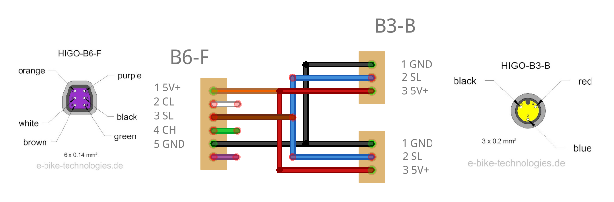
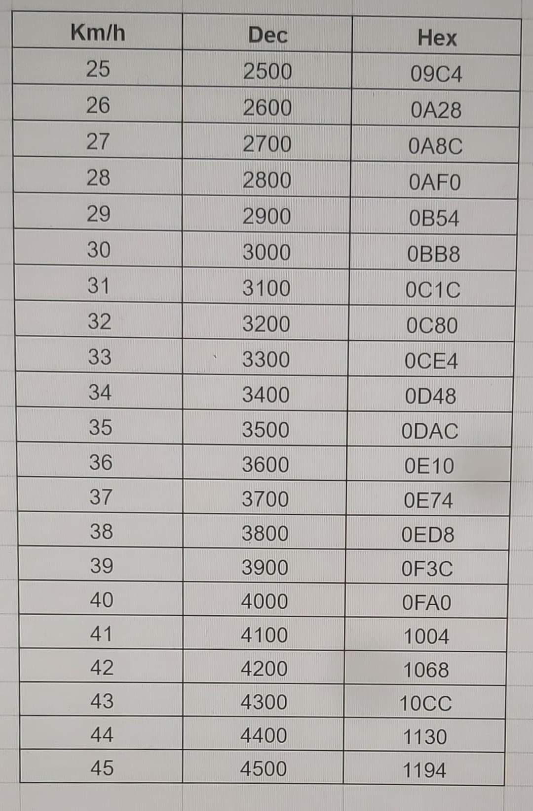
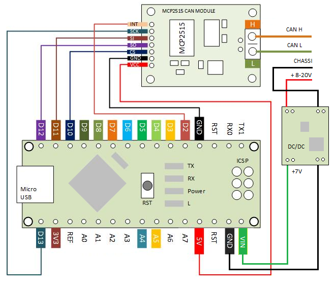

This repo contains 2 scripts to adjust the motor speed of a Bafang M200 motor (`BafangSpeedAdjust`) and to reset the speed back to the legal speed of 25 km/h on the go (`BafangSpeedReset`)

# BafangSpeedAdjust

Simple speed adjustment for my bafang motor using CAN BUS on my Veloretti ace

What do you need:

- Arduino Nano = <5 euro
- [MCP 2515 CAN module](https://www.amazon.nl/gp/product/B07MY2D7TW/) = 7 euro
- [Bafang 6 pin brake cable (Female)](https://www.aliexpress.com/item/1005004128109927.html) = 9 euro or [here](https://a.aliexpress.com/_EIiGmyn) = 5.57

Connect MCP 2515 and arduino like shown [here](https://github.com/autowp/arduino-mcp2515) (no need for power converter, power comes over usb to the arduino and can module):

Connect the brake cable to the MCP 2515 module (H = green cable, L= white cable)

Download the [MCP 2515 arduino library](https://github.com/autowp/arduino-mcp2515) and add to the arduino ide as described

Copy code demo in ino file (try reading without writing the speed setting check if read code starts with 82F83203, first characters could be different)

Remove plastic cover from motor with 3 torx screws
Connect the cable to the bafang motor (purple connector, bike can be switched on)
And plug the arduino with an usb cable into a computer or smartphone (If you want to read the serial output, if you don't want to read the output and just write the new setting a powerbank is fine. I use the app serial monitor on android, adjust the baudrate to 115200)
If all is connected correctly, you should see a lot of data passing by in the serial monitor.

If you wait 10 seconds (set in code), the speed will be set to 35km/h

!!! USE AT OWN RISK !!!

# BafangSpeedReset

Script to set the bike back to 25 kmph with a button, in case of an emergency (!)
Inserted a led somewhere to confirm speed setting.
Most likely you will want to turn a led off when set to 25 kmph; just to check whether it succeeded and make it invisible.
Nb: whole unit can be placed within the frame of the bike; plenty of room in the tube that runs downwards from the saddle; especially when you remove the gps unit.
One cable that runs to the motor and two others that runs to a led and a pushbutton/switch.
Led and button can be placed anywhere out of normal sight.

When you get home, use another unit to get your bike back to higher assist speeds
NB: When you power down the bike, on next restart the led will light up, in spite of having the bike at 25 kmph. Working on that issue! (or I just leave it as is)

!!! USE AT OWN RISK !!!

## Pinout 6 PIN brake cable

## Speed table

## Wiring for arduino nano

## ESP32 to MCP2515 Wiring (SPI)

| MCP2515 Pin | ESP32 Pin | Description |
|-------------|-----------|-------------|
| VCC | 5V | Power supply |
| GND | GND | Ground |
| CS (Chip Select) | GPIO5 | SPI Chip Select (configurable) |
| SO (MISO) | GPIO19 | SPI MISO |
| SI (MOSI) | GPIO23 | SPI MOSI |
| SCK | GPIO18 | SPI Clock |
| INT | GPIO4 | Interrupt pin (configurable) |

Connect the 5V and ground from the HIGO connector the esp32. and connect the CANH and CANL to the MCP2515 ports.